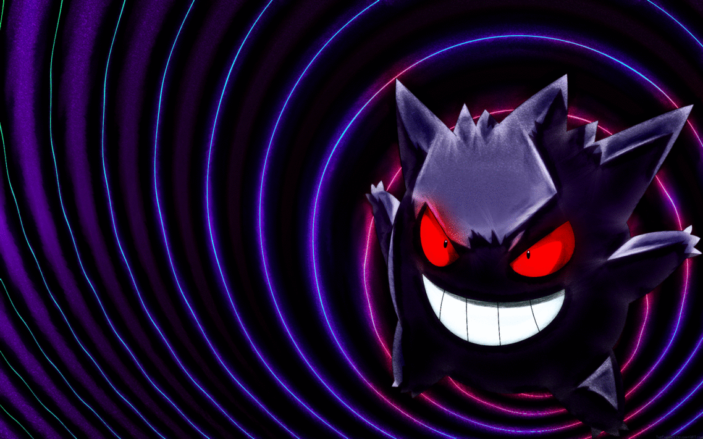
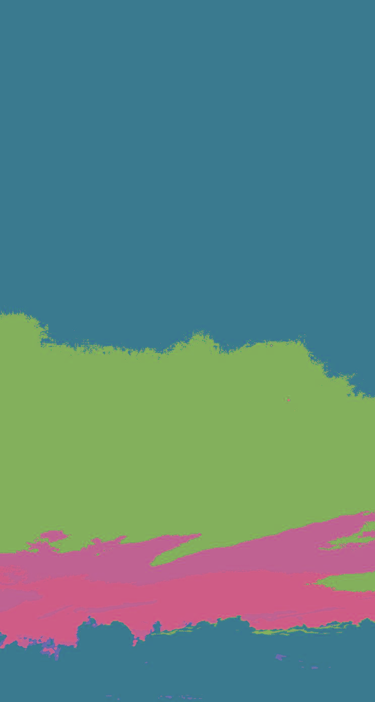
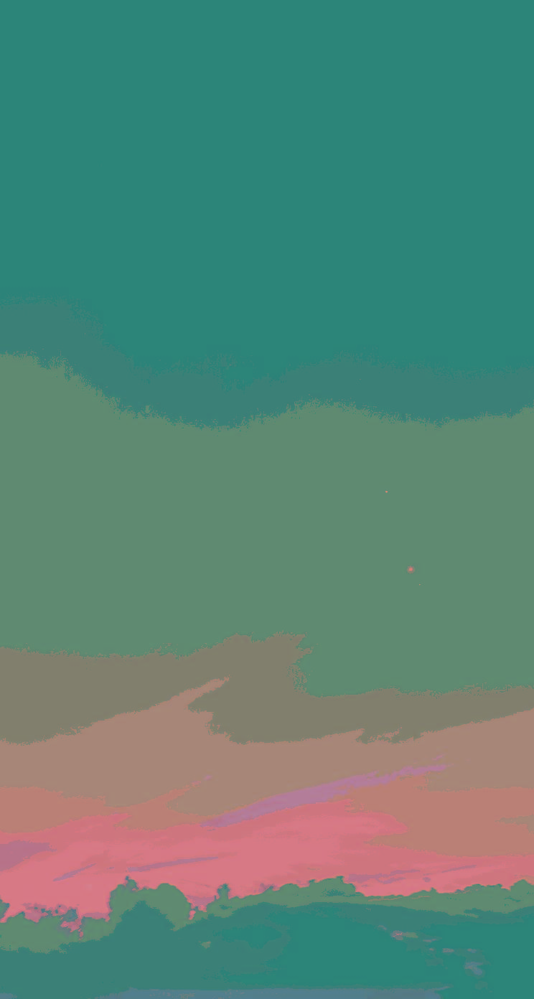

# Image filter

<h2><b>Version 0.2 - Palette plugin</h2></b>

<h3>Adding your own colors palette</h3>
<ul>
    <li>[Option] | Create your own palette file at "./resources/palettes/".</li>
    <li>Add your own palette definition (follow instructions at "./resources/palettes/palettes_examples.if") on your desired palette file.</li>
</ul>

    

---------------------------------------

<h2><b>Version 0.1</h2></b>

<h3>Available palettes</h3>
<ul>
    <li>Custom 5 colors.</li>
    <li>Custom 8 colors.</li>
    <li>Custom 16 colors.</li>
</ul>

Source image and processed images [source-p5-p8-p16]. 

    
    
    
    

---------------------------------------

<h3>Custom 5 colors palette</h3>

| Filter color     | RGB value  |
| ------------- |:-------------:|
| Dark Burgundy | [79,49,48]    |
| Burgundy      | [80,140,215]  |
| Orange        | [170,80,66]   |
| Skin          | [216,189,138] |
| Yellow        | [216,215,143] |

---------------------------------------

<h3>Custom 8 colors palette</h3>

| Filter color     | RGB value  |
| ------------- |:-------------:|
| Black       | [0,0,0]         |
| Violet      | [85,65,95]      |
| Gray        | [100,105,100]   |
| Orange      | [215,115,85]    |
| Blue        | [80,140,215]    |
| Green       | [100,185,100]   |
| Yellow      | [230,200,110]   |
| White       | [220,245,255]   |

---------------------------------------

<h3>Custom 16 colors palette</h3>

| Filter color     | RGB value  |
| ------------- |:-------------:|
| Light Pink            | [232,204,210]   |
| Light Beige           | [222,214,202]   |
| Light LightGreen      | [203,211,187]   |
| Light DarkGreen       | [171,193,185]   |
| Light DarkBlue        | [156,171,177]   |
| Pink                  | [214,162,173]   |
| Beige                 | [195,181,159]   |
| LightGreen            | [160,175,132]   |
| DarkGreen             | [102,143,128]   |
| DarkBlue              | [74,102,112]    |
| Dark Pink             | [98,74,79]      |
| Dark Beige            | [89,83,73]      |
| Dark LightGreen       | [73,80,60]      |
| Dark DarkGreen        | [47,65,59]      |
| Dark DarkBlue         | [34,47,51]      |
| Gray                  | [100,105,100]   |

---------------------------------------

<h2>[Try it out]</h2>
    1. Put the desired images in "/resources/input/". 
    2. Launch by double clicking on ImageFilter.jar. 
3. Wait few seconds and enjoy processed images at "/resources/output" :)
